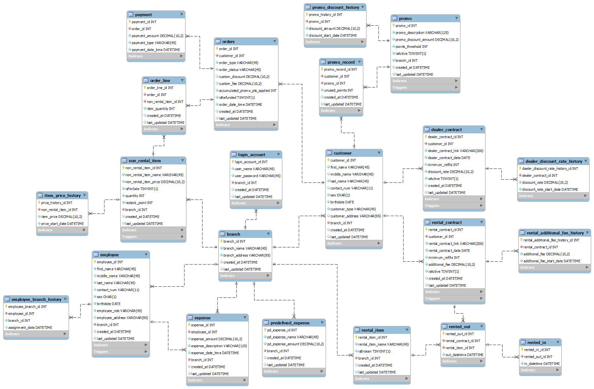

# Uniqclear Water Refilling Station Integrated Business Management System

</img>

A desktop application developed for Software Engineering 2 course.

## Objectives

- To develop a system that lets the business keep track of inventory items easily

- To develop a system that easily tracks total sales and expenses within a specific time period

- To develop a system that keeps track of each customer's promo record

- To develop a system that standardizes contract agreements between renters and dealers

- To develop a system that keeps track of orders

- To solve the organization's problem of excessive paper use in their business processes

## Subsystems

- Rental Item Inventory Module

- Non-rental Item Inventory Module

- Employee Profiling Module

- Customer Profiling Module

- Sales Reports and Expenses Module

- Ordering Module

- Promo Tracking Module

- Contract Management Module

## Database Design

**branch**

| Type         | Column Name    |
| -------------| ---------------|
| integer      | branch_id      |
| varchar(45)  | branch_name    |
| varchar(95)  | branch_address |
| datetime     | created_at     |
| datetime     | last_updated   |

**customer**

| Type         | Column Name      |
| -------------| -----------------|
| integer      | customer_id      |
| varchar(45)  | first_name       |
| varchar(45)  | middle_name      |
| varchar(45)  | last_name        |
| varchar(11)  | contact_num      |
| char(1)      | sex              |
| date         | birthdate        |
| varchar(45)  | customer_type    |
| varchar(95)  | customer_address |
| integer      | branch_id        |
| datetime     | created_at       |
| datetime     | last_updated     |

**dealer_contract**

| Type          | Column Name          |
| --------------| ---------------------|
| integer       | dealer_contract_id   |
| integer       | customer_id          |
| varchar(200)  | dealer_contract_link |
| date          | dealer_contract_date |
| integer       | minimum_refills      |
| decimal(10,2) | discount_rate        |
| tinyint(1)    | isActive             |
| datetime      | created_at           |
| datetime      | last_updated         |

**dealer_discount_rate_history**

| Type          | Column Name                     |
| --------------| --------------------------------|
| integer       | dealer_discount_rate_history_id |
| integer       | dealer_contract_id              |
| datetime      | discount_rate_start_date        |

**employee**

| Type         | Column Name      |
| -------------| -----------------|
| integer      | employee_id      |
| varchar(45)  | first_name       |
| varchar(45)  | middle_name      |
| varchar(45)  | last_name        |
| varchar(11)  | contact_num      |
| char(1)      | sex              |
| date         | birthdate        |
| varchar(45)  | employee_role    |
| varchar(95)  | employee_address |
| integer      | branch_id        |
| datetime     | created_at       |
| datetime     | last_updated     |

**employee_branch_history**

| Type         | Column Name        |
| -------------| -------------------|
| integer      | employee_branch_id |
| integer      | employee_id        |
| integer      | branch_id          |
| datetime     | assignment_date    |

**expense**

| Type          | Column Name         |
| --------------| --------------------|
| integer       | expense_id          |
| integer       | employee_id         |
| decimal(10,2) | expense_amount      |
| varchar(125)  | expense_description |
| datetime      | expense_date_time   |
| integer       | branch_id           |
| datetime      | created_at          |
| datetime      | last_updated        |

**item_price_history**

| Type          | Column Name         |
| --------------| --------------------|
| integer       | price_history_id    |
| integer       | non_rental_item_id  |
| decimal(10,2) | item_price          |
| datetime      | price_start_date    |

**non_rental_item**

| Type          | Column Name           |
| --------------| ----------------------|
| integer       | non_rental_item_id    |
| varchar(45)   | non_rental_item_name  |
| decimal(10,2) | non_rental_item_price |
| tinyint(1)    | isForSale             |
| integer       | quantity              |
| integer       | restock_point         |
| integer       | branch_id             |
| datetime      | created_at            |
| datetime      | last_updated          |

**order_line**

| Type          | Column Name        |
| --------------| -------------------|
| integer       | order_line_id      |
| integer       | order_id           |
| integer       | non_rental_item_id |
| integer       | item_quantity      |
| datetime      | created_at         |
| datetime      | last_updated       |

**orders**

| Type          | Column Name                   |
| --------------| ------------------------------|
| integer       | order_id                      |
| integer       | customer_id                   |
| varchar(45)   | order_type                    |
| varchar(45)   | order_status                  |
| decimal(10,2) | custom_discount               |
| decimal(10,2) | custom_fee                    |
| integer       | accumulated_promo_pts_applied |
| tinyint(1)    | isRefunded                    |
| datetime      | order_date_time               |
| datetime      | created_at                    |
| datetime      | last_updated                  |

**payment**

| Type          | Column Name       |
| --------------| ------------------|
| integer       | payment_id        |
| integer       | order_id          |
| decimal(10,2) | payment_amount    |
| varchar(45)   | payment_type      |
| datetime      | payment_date_time |

**predefined_expense**

| Type          | Column Name       |
| --------------| ------------------|
| integer       | pd_expense_id     |
| varchar(45)   | pd_expense_name   |
| decimal(10,2) | pd_expense_amount |
| integer       | branch_id         |
| datetime      | created_at        |
| datetime      | last_updated      |

**promo**

| Type          | Column Name           |
| --------------| ----------------------|
| integer       | promo_id              |
| varchar(125)  | promo_description     |
| decimal(10,2) | promo_discount_amount |
| integer       | points_threshold      |
| tinyint(1)    | isActive              |
| integer       | branch_id             |
| datetime      | created_at            |
| datetime      | last_updated          |

**promo_discount_history**

| Type          | Column Name         |
| --------------| --------------------|
| integer       | promo_history_id    |
| integer       | promo_id            |
| decimal(10,2) | discount_amount     |
| datetime      | discount_start_date |

**promo_record**

| Type          | Column Name         |
| --------------| --------------------|
| integer       | promo_record_id     |
| integer       | customer_id         |
| integer       | promo_id            |
| integer       | unused_points       |
| datetime      | created_at          |
| datetime      | last_updated        |

**rental_additional_fee_history**

| Type          | Column Name                      |
| --------------| ---------------------------------|
| integer       | rental_additional_fee_history_id |
| integer       | rental_contract_id               |
| decimal(10,2) | additional_fee                   |
| datetime      | additional_fee_start_date        |

**rental_contract**

| Type          | Column Name          |
| --------------| ---------------------|
| integer       | rental_contract_id   |
| integer       | customer_id          |
| varchar(200)  | rental_contract_link |
| date          | rental_contract_date |
| integer       | minimum_refills      |
| decimal(10,2) | additional_fee       |
| tinyint(1)    | isActive             |
| datetime      | created_at           |
| datetime      | last_updated         |

**rental_item**

| Type         | Column Name      |
| -------------| -----------------|
| integer      | rental_item_id   |
| varchar(45)  | rental_item_name |
| tinyint(1)   | isBroken         |
| integer      | branch_id        |
| datetime     | created_at       |
| datetime     | last_updated     |

**rented_in**

| Type         | Column Name   |
| -------------| --------------|
| integer      | rented_in_id  |
| integer      | rented_out_id |
| datetime     | in_datetime   |

**rented_out**

| Type         | Column Name        |
| -------------| -------------------|
| integer      | rented_out_id      |
| integer      | rental_contract_id |
| integer      | rental_item_id     |
| datetime     | out_datetime       |

## Database Diagram
</img>